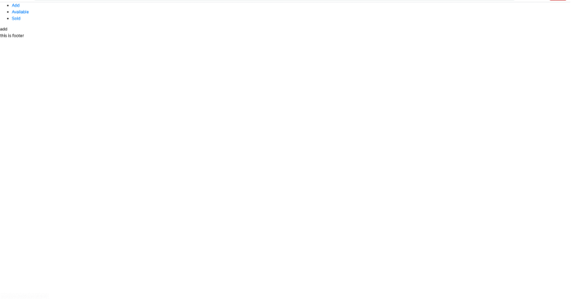
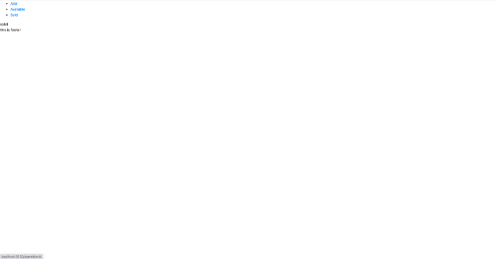
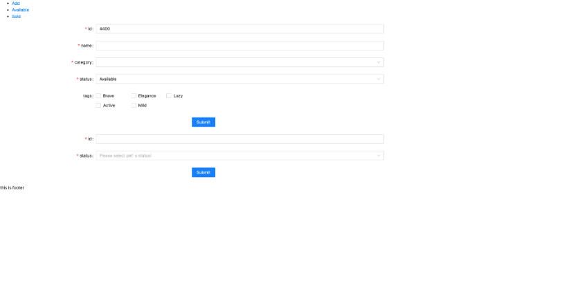
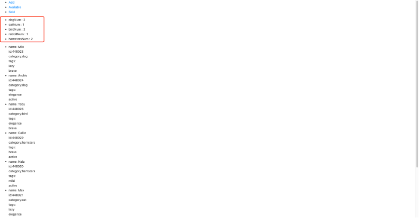
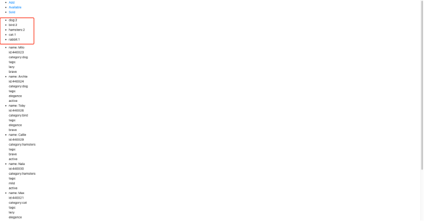

# UX Development
原来的代码使用原生js进行开发的。经过讨论决定（后面会有具体的原因），我们打算使用react框架进行开发。因此我们决定从0开始搭建网站
搭建网站我分为两大部分，第一部分是完成功能，第二部分是写style(css)
## 实现功能
### 1. 引入react进行开发，实现hello world页面：
* 详细内容:
用create-react-app 这个命令，实现react的初始化。然后删除不需要的文件，只保留最简单的文件结构
* 图片:


* commit: e5745f1764d9af54a4214dbd8bb13c88de9a467d
* time: 2021/07/27 21:16

### 2. 完成module目录 
* 详细内容: 这一部分是没有ui上面的变化的，只是根据我们网站的feature，对有可能用到的api进行封装，然后放到module目录中。由于这个项目比较简单，所以我们统一把所有需要用的的api写在module/index.js文件中。
在这一部分我们引入了axios库，对api进行封装，返回一个Promise instance，以便于调用的时候进行错误处理。
根据功能，选择了4个api，分别是
1. findByStatus (/pet/{petId}/uploadImage)
2. delete （/pet/{petId}）
3. add (/pet)
4. update  (/pet/{petId})

其中findByStatus, delete, add 是在原来的网站中就有使用的，而update是我们新调用的api

* 图片: 没有ui上的变化
* commit: 6d51adb8a6e45afa34f27eb8e1dad0556127db62
* time:  2021/07/28 : 10:42

### 3. 确定网站结构
* 详细内容: 根据需求，我确定了网站的结构
1.	一共需要三个页面，分别是available，sold，add（页面的名字有可能后续会发生变化）
2.	每个页面都有header main footer。因此我们把header和footer抽离出来，作为三个页面的公用组件，每个页面的main不相同。

    引入react-router 实现不同页面之间的跳转
* 图片：
1. page available 

2. page add

3. page sold


* commit: e6bce91551030471ba85272deec55c7a7602a364
* time: 2021/07/28 12:00

### 4. add页面添加可以添加宠物的表单
* 详细内容: 使用antd的form表单组件，根据项目具体需要的功能进行修改，通过提交form表单即可以创建新的pet。需要搜集的信息有id，name，category，status，tags。其中要注意的是，我们的id以4400开头，是为了不修改到其他人的数据，怕overwrite其他组的成员创建好的宠物。
* 图片: 

* commit: 0b082b9bd299f102b805fc821a24768ef733c382
* time: 2021/07/28 17:54

### 5. add页面添加可以修改宠物状态的表单
* 详细内容: 引入antd的form组件，只需要输入需要修改状态的宠物的id，还有新的状态，就可以实现宠物的状态修改
* 图片:

* commit: c9e393f085f4741b355488194673823830baa82f
* time: 2021/07/29 20:18

### 6. available页面的筛选表单
* 详细内容: available页面本来只是展示可以购买的宠物。我们根据新的feature，加入了form表单，让用户可以更具自己的喜好进行筛选，可以选择宠物的category和tag

* 图片:

* commit: c9e393f085f4741b355488194673823830baa82f
* time: 2021/07/29 20:18

### 7. sold页面加入统计模块
* 详细内容:sold页面原本只是对状态为sold和pending的宠物进行展示。根据新feature的需要，我们加入一个统计的模块，根据宠物的category，对数量进行统计
* 图片:

* commit: c9e393f085f4741b355488194673823830baa82f
* time: 2021/07/29 20:18

### 8. sold页面的统计模块升级为rank模块
* 详细内容: 我们原本只是希望sold页面可以展示已经出售的宠物各个种类的数量，但是由于新的需求，我们需要根据各个种类出售的数量，做一个rank表。具体的实现方法是，我们得对原本的数组进行一次sort，让该数组从大到小排序
* 图片: 

* commit: c9e393f085f4741b355488194673823830baa82f
* time: 2021/07/29 20:18

### 9. 实现sold页面和available页面之间的跳转
* 详细内容: 新的功能需要点击sold页面中rank模块对应的宠物，就可以跳转到available页面中category对应的宠物的筛选结果。具体的实现是通过跳转时带上query实现的。跳转用的是react-router的```history.push```这个函数
* 图片: 没有ui上的改动
* commit: 5b18ebc1924dd005fb39af6cd0d851e8038fa4d8
* time: 2021/08/02 23:40

### 10. 实现available页面中宠物的删除
* 详细内容: 加入了删除宠物的功能。只要点击宠物的delete按钮，就会触法帮点在onClick的event的函数，把当前的宠物的id最为参数，调用该函数，最终调用delete的api，在数据库中删除宠物，同时更新页面
* 图片:

* commit: c9e393f085f4741b355488194673823830baa82f
* time: 2021/07/29 20:18
# Final UX
写完css在具体写着一块
1. 公共组件:
    1. header
    * 布局
    * 功能
    2. footer
    * 布局
    * 功能

2. ava页面
* 布局
* 筛选表单
* 展示list
3. sold页面
* 布局
* rank
* 展示list
4. add页面
* 布局
* 添加表单
* 修改状态表单
# Design Choices
## 1、 框架选择
## 2、 目录设计
## 3、 路由设计
## 4、 页面结构设计
## 5、 组件库选择
## 6、 状态管理工具选择
## 7、 样式布局选择

# Evaluation 
